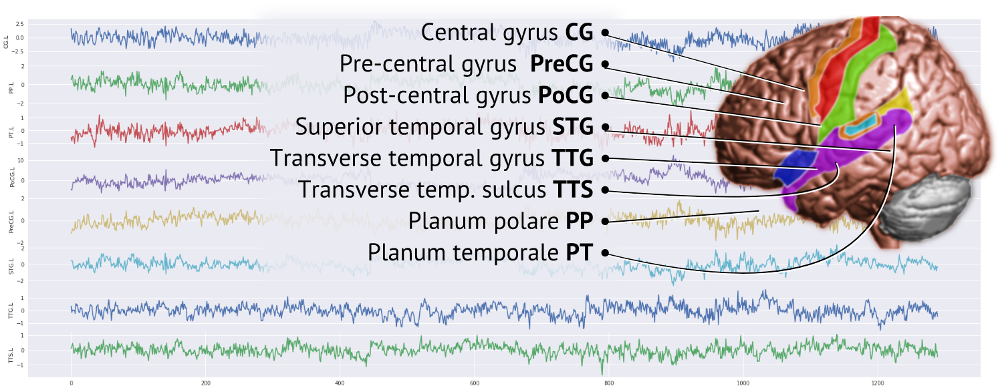

# MODELING DYNAMIC CONNECTIVITY STATES

## Introduction

Brain connectivity is frequently examined with functional neuroimaging
as a method to quantify changes in interactions between distinct brain
regions.

**MOTIVATION**:

* Current models can describe the transitions between Brain connectivity
states detecting both smooth and abrupt changes. But, with a lack
of coherence in a multi-subject analysis.
* Also, clustering-based methods are not capable of assigning fixed
state labels for multi-subject, or, inter-experiment comparisons,
due to random effects (K-means) or length of the data (hierarchical
clustering.

**OBJECTIVE**:

* To capture \textbf{\color{aaublue1}consistent dynamic changes }in Brain connectivity
states from participants who are exposed to different types of audio-visual
and cognitive stimuli while watching a movie.
This experiment setting promotes continuous transitions between the
different stimuli and, consequently, the states in a more natural
condition.

**CONTRIBUTIONS**:

* A method that consistently explains Brain connectivity changes in different subjects.
* A model which "state labels" are guaranteed to be the same among different experimental executions and different subjects.
* A computationally efficient, highly scalable, and real-time algorithm for detecting the states.

## Dataset

The dataset consists of fMRI recordings from fourteen subjects watching
a movie. Region-specific time series were extracted from the following
areas (eight per hemisphere):

During the movie, a 32-minute long TV show, 16 primary stimuli were
triggered in four types of different auditory backgrounds: "silence",
"noise", "music",
and "song".

## TVVAR-RP Model

### Time-varying vector autoregressive model (TV-VAR)

Generalization of a vector autoregressive model that employs a local
stationary approach to model non-stationary signals: each 
can be expressed in terms of past data .
This can be also used for modeling time-varying directed networks:

Y_{t-\ell}+\eta_{t},\ \ \ \eta_{t}\sim\mathcal{N}\left(0,\Sigma\right))

* =\left[\phi_{ij,t}\left(\ell\right)\right]):
matricial representation of the VAR coefficients, or directed network
of N regions, at lag l and time t.
* \right|>0): strength of causal
influence from region j to region i.

### Local sensitive hashing - random projection (LSH/RP)

Method to approximate nearest neighbor search for high-dimensional
cases. It can identify discrete connectivity states with more accurate
clustering of time-varying connectivity over other classical approaches
like K-means. An LSH family of hash functions $h$ must satisfy the
following conditions:

=h\left(y\right)\right]\ge p_{1} & \text{if }d\left(x,y\right)\le r_{1}\\\mathbb{P}\left[h\left(x\right)=h\left(y\right)\right]\le p_{2} & \text{if }d\left(x,y\right)\ge r_{2}\end{cases})

where h is the LSH hash function, and , and .

Let  be K random
projections sampled from a distribution ).
With =\mathbb{I}\left(V_{i}^{T}x>0\right)), each
(vectorized) TV-VAR coefficient matrix  is assigned
to a binary-encoded hash code  (the brain connectivity state):

,\;\;L_{t}\in\left\{ 0,1,\ldots,2^{K}-1\right\} )

### State occupancy comparison

Given stimulus labels at each time point, we compute the occupancy
of connectivity states for each one. The similarity between each (stimulus-conditional)
probability mass distribution (PMF) of state occupancies is calculated
using a symmetric Kullback\textendash Leibler (SKL) divergence:

=\left|\sum_{i}P\left(i\right)\log\frac{Q\left(i\right)}{P\left(i\right)}\right|+\left|\sum_{i}Q\left(i\right)\log\frac{P\left(i\right)}{Q\left(i\right)}\right|)

where P and Q are PMFs

**State occupancy in Subject 6251**

**State occupancy in Subject 6251**

### Cross-subject state occupancy comparison

The SKL dissimilarity matrix between audiovisual stimuli shows cross-subject
consistency (red boxes indicate groupings of different auditory events:
song, music, noise, and silence backgrounds).

### Brain connectivity

Given the PMF of state occupancies, we calculate the expected connectivity
states for all subjects. 

**Subject 6251**

**Subject 6389**

### Cross-subject Brain connectivity comparison

The results, consequently, show a cross-subject
consistency, that explains Brain dynamics in response to a specific
stimulus.
The following shows an example of the Brain response to a specific stimulus:

## Conclusion

This model can capture changes in connectivity and described connectivity
structures through the different states in fMRI with complex and diverse
stimuli concerning the activity of watching a movie and provide an
explanation that could be shared to the patients that were analyzed.

# Credits

A project of the KAUST Biostatistics Group ([biostats.kaust.edu.sa](https://biostats.kaust.edu.sa/Pages/Home.aspx)).

* **Lead Software Developer**: Marco Pinto

* **PI**: Hernando Ombao

* **Members**: Chee-Ming Ting and Marco Pinto

# License

Licensed under either

* GPL license, Version 3.0, (GPL-LICENSE or https://opensource.org/licenses/GPL-3.0)
* MIT license (MIT-LICENSE or http://opensource.org/licenses/MIT)
